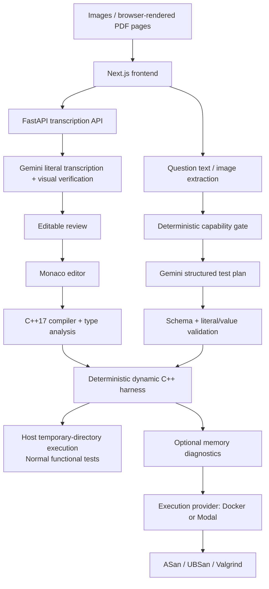
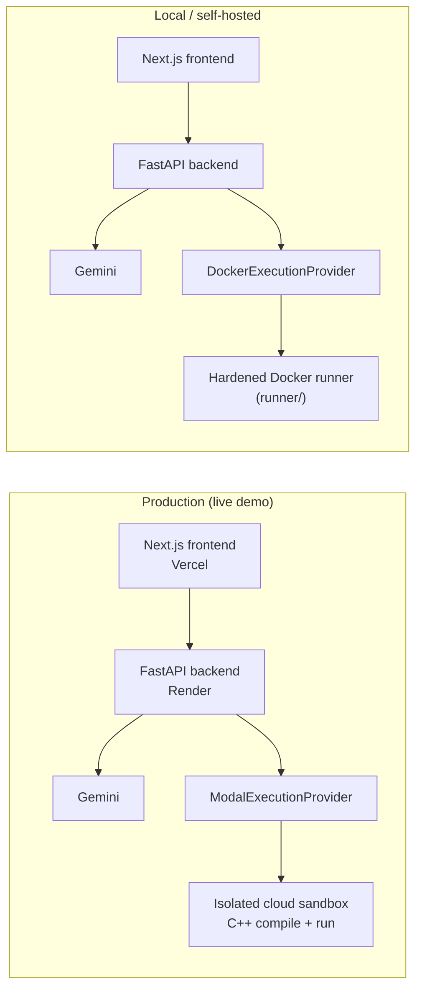

# Ink to Code

Turn handwritten C++ into editable code, compile it, test it, and generate structured practice feedback.

Ink to Code converts handwritten C++ from images or PDFs into reviewed, editable source, then provides an IDE-style environment for compilation, manual testing, AI-generated tests, and deeper C++ behavior checks. Gemini handles multimodal transcription and proposes structured test plans, but deterministic validation, compiler tooling, harness generation, and execution remain authoritative—the project is more than an OCR wrapper.

**[Live demo →](https://inktocode-frontend.vercel.app)** — a real, fully smoke-tested deployment: Vercel frontend, FastAPI on Render, Gemini transcription/AI-test generation, and isolated C++ execution via Modal cloud sandboxes.

<!-- Add polished Ink to Code editor screenshot here -->

## Highlights

- Multimodal handwritten C++ transcription from ordered images or browser-rendered PDF pages
- Two-pass Gemini pipeline: literal transcription followed by visual verification
- Editable review step and Monaco-based IDE workflow
- Real C++17 compilation with structured diagnostics and raw compiler output
- Manual tests and constrained AI-generated practice tests
- Strict AI-test schemas, capability gating, value validation, deduplication, and bounded repair
- Defined support for primitives, arrays, pointers, 15 STL containers, iterators, classes, operators, inheritance, polymorphism, and templates
- Isolated compilation, testing, and memory diagnostics (AddressSanitizer, UndefinedBehaviorSanitizer, and — on the Docker path — Valgrind) through a pluggable execution provider: `DockerExecutionProvider` for local/self-hosted use, `ModalExecutionProvider` in production (see [`docs/internal/MODAL_DEPLOYMENT.md`](docs/internal/MODAL_DEPLOYMENT.md))
- 1,104 automated frontend/backend tests currently pass (881 backend + 223 frontend) with the Docker runner available, plus a live Modal integration suite run against real cloud infrastructure before production deploys

## How It Works

1. **Upload** — Add up to five ordered handwritten-code images or one PDF of up to five pages. Programming-question pages are optional.
2. **Transcribe** — Gemini performs a literal multimodal transcription without repairing apparent C++ mistakes.
3. **Verify** — A second Gemini pass checks the candidate against the original handwriting for visual faithfulness.
4. **Review** — Edit the verified transcription before it enters the coding workspace.
5. **Compile** — The current Monaco contents are checked by a real C++17 compiler; source is never silently reformatted or repaired.
6. **Test** — Run explicit program/function/object tests or request structured AI-generated practice tests from the assignment question.
7. **Inspect results** — Review behavior, stdout, mutations, exceptions, compiler diagnostics, and optional memory findings as separate result channels.

```text
Handwritten image/PDF → multimodal transcription → visual verification → review
→ Monaco editor → compile → manual or AI-generated tests → structured results
```

## Architecture



The frontend owns upload, review, editor, and result presentation. FastAPI separates routes, Pydantic contracts, external AI calls, source analysis, compiler operations, and execution services. All submitted C++ compilation and execution fails closed through the configured execution provider — Docker locally by default, or Modal isolated cloud sandboxes when deployed; the API host has no execution fallback on either path.

### Deployment Topology

The same application code runs against two interchangeable execution back ends, selected by `CPP_EXECUTION_PROVIDER`:



Both providers implement the same `ExecutionProvider` interface and run the identical `runner/` image contents — only the launch mechanism differs. `DockerExecutionProvider` is the hardened default for running Ink to Code locally or on your own infrastructure. Render — like most PaaS hosts — does not let a web service run a privileged Docker daemon, so production execution instead runs through Modal's isolated, ephemeral cloud sandboxes with equivalent or compensating controls (see [Execution Safety](#execution-safety) below), rather than weakening isolation or self-managing a VM just to keep a Docker daemon available.

## Multimodal Transcription Pipeline

1. Gemini receives all ordered handwritten-code pages together and produces a literal structured transcription.
2. A second request receives the original pages plus the first candidate and verifies visual faithfulness.
3. Pydantic validates code, confidence metadata, uncertain regions, and page references.
4. Blocked, empty, malformed, timed-out, and failed verification responses are surfaced explicitly. A failed second pass is never silently replaced with the unverified first result.

Question pages can supply separately identified context, but the handwritten code remains the source of truth. The verified result still passes through an editable review screen before entering Monaco.

## AI Test Generation

```text
Question/context → capability gate → Gemini structured test plan
→ schema validation → literal/value validation → deduplication
→ optional repair → deterministic executor → results
```

The LLM proposes data-only test cases; it does not generate harness source, compiler flags, executable expressions, or run code. The backend checks the selected target, validates every argument and expected result against the supported signature, removes behavioral duplicates, and converts accepted plans into the same typed cases used by manual execution.

Each action generates at most **8 tests**. Generation uses one Gemini call plus at most one repair call when the plan produces no usable tests. **Rerun Same Tests** makes no Gemini call and revalidates stored tests against the current source. The deterministic C++ compiler and execution layer—not Gemini—decides whether code compiles and whether a test passes.

## C++ Testing Engine

For supported function-only and object submissions, the backend builds a temporary C++17 harness around the unchanged Monaco source. It validates structured inputs, generates safe literals, compiles the combined translation unit, executes the selected target, and serializes observed results for comparison.

The defined testing subset includes:

- primitive and string arguments and return values
- scalar references and supported scalar pointers
- one-dimensional C-style numeric arrays with explicit size parameters
- STL containers and two-dimensional nested vectors
- iterator inputs, ranges, returns, and supported mutations
- return values, captured stdout, exceptions, and multiple mutable outputs
- public class/struct constructors and ordered method scenarios
- selected overloaded operators and observable object-valued results
- copy/move behavior, single public inheritance, virtual dispatch, and polymorphism scenarios
- supported function and class-template instantiations

The parser intentionally supports a defined subset of C++ patterns rather than arbitrary C++ syntax. Unsupported or ambiguous signatures are rejected instead of guessed.

## Supported STL Types

| Family | Explicitly supported containers |
| --- | --- |
| Sequence | `std::vector`, `std::array`, `std::deque`, `std::list` |
| Ordered associative | `std::set`, `std::multiset`, `std::map`, `std::multimap` |
| Unordered associative | `std::unordered_set`, `std::unordered_multiset`, `std::unordered_map`, `std::unordered_multimap` |
| Adapters | `std::stack`, `std::queue`, `std::priority_queue` |

Supported iterator families are `std::vector<T>::iterator`, `std::deque<T>::iterator`, `std::list<T>::iterator`, and `std::array<T, N>::iterator`, including their `const_iterator` variants. Single iterators and validated adjacent half-open ranges are supported; reverse iterators, associative-container iterators, and iterators over nested elements are outside the current subset.

## Compiler Diagnostics

- The backend invokes a real compiler with a fixed C++17 argument list and `shell=False`.
- Manual compile performs syntax/type checking only and never executes the program.
- Compiler output is parsed into ordered diagnostics and displayed as Monaco markers.
- Beginner-facing explanations are deterministic and conservative; they do not invent intended code or automatic fixes.
- Raw compiler output remains available and authoritative.
- After the first compile, source changes trigger a 900 ms debounced check. Markers are cleared on edit, and stale or out-of-order responses cannot replace newer results.

Gemini is not involved in compiler diagnosis, explanation, or source repair.

## Execution Safety

Normal compile and test execution uses a required, isolated execution
provider — selected by `CPP_EXECUTION_PROVIDER` (`docker` by default, or
`modal`) — with fixed commands, no network, strict resource/time/output
limits, and automatic cleanup. Student code runs only after an explicit
**Run Tests** action; automatic compilation checks source without
executing the resulting program. There is no host fallback on either
provider: if the configured provider's runtime or runner image is
unavailable, requests report an infrastructure error instead of silently
degrading.

Current normal-execution limits include:

- **2-second** timeout per functional test
- **64 KiB** limits for stdout and stderr
- fixed compiler/executable paths and no user-controlled flags or shell commands

Both providers are hardened isolation boundaries, but they are not
identical on every control. The honest comparison (see
[`docs/internal/MODAL_DEPLOYMENT.md`](docs/internal/MODAL_DEPLOYMENT.md)
and `AGENTS.md` for the complete, per-control rationale):

| Control | Docker | Modal |
| --- | --- | --- |
| Non-root execution | native (`--user`, uid 10001) | compensating control (`setpriv` inside the sandbox, which itself runs as root) |
| Network disabled | native | native |
| Read-only root filesystem | native | **not available** — compensated only by every sandbox being single-use and ephemeral |
| Capability dropping | native (`--cap-drop ALL`) | not an equivalent control (gVisor userspace kernel + non-root instead) |
| Memory limit | hard cap | hard cap, OOM-kills |
| CPU limit | hard CFS quota | soft throttle (wall-clock timeout is the real control on both) |
| PID limit | native (`--pids-limit`) | `ulimit -u`, proven under gVisor by the live Modal security-test suite (§4) |
| Secret isolation | no `-e` flags passed at all | hermetic `env -i` launch; no Modal/Gemini credential ever reaches user code |
| Isolated workspace | one bind-mounted temp directory | no host mounts at all (stronger) |

Public deployment is live at the [demo above](https://inktocode-frontend.vercel.app). Before relying on the compensating controls above in production, the live Modal security-test suite (`backend/tests/test_modal_integration.py`, marked `modal_live`) was run twice against real Modal infrastructure, and a full end-to-end production smoke test was completed against the live deployment — see [`docs/internal/MODAL_DEPLOYMENT.md`](docs/internal/MODAL_DEPLOYMENT.md) for the Modal token/image setup and the exact live security-test procedure.

Memory diagnostics are proven on both paths, but not identically: Valgrind is proven on the Docker path; on Modal, ASan/UBSan/LeakSanitizer are the proven memory-diagnostic tools (Valgrind is not confirmed working through the Modal sandbox specifically).

## Tech Stack

| Area | Technologies |
| --- | --- |
| Frontend | Next.js 16, React 19, TypeScript, Tailwind CSS 4, Monaco Editor, PDF.js |
| Backend | Python, FastAPI, Pydantic, Google Gen AI Python SDK, Uvicorn |
| Execution | C++17, g++/compatible compiler tooling, Docker (default) or Modal cloud sandboxes, AddressSanitizer, UndefinedBehaviorSanitizer, Valgrind |
| Verification | pytest, Node.js built-in test runner, ESLint, TypeScript/Next.js production build |

## Verification

Current local audit results:

| Check | Result |
| --- | --- |
| Backend tests | 881 passed with the Docker runner available |
| Backend Python compilation | `python -m compileall app` passed |
| Frontend tests | 223 / 223 passed |
| Frontend lint | passed |
| Frontend production build | passed |
| Docker runner integration | passed |
| Live Modal security-test suite | 12/12 passed, run twice against real Modal infrastructure |
| Production smoke test | 17/17 real end-to-end checks passed against the [live deployment](https://inktocode-frontend.vercel.app) |

Backend tests mock external Gemini requests and do not consume API quota. No coverage percentage, transcription-accuracy figure, or AI test-quality benchmark is claimed.

## Continuous Integration

GitHub Actions now separates fast backend checks, frontend verification,
Docker-backed execution-security tests, main-branch full regression,
dependency auditing, and secret scanning. Pull requests run every gate except
the four-to-five-minute full backend regression; pushes to `main` and manual
workflow dispatches run the complete set.

Workflows use read-only repository permissions and never receive Gemini or
deployment credentials. See
[`CI_SECURITY_PLAN.md`](CI_SECURITY_PLAN.md) for the enforced test map,
scanner policies, expected runtime, and the exact pre-deployment procedure.

## Local Setup

### Prerequisites

- Python 3.13 or another version compatible with the backend dependencies
- Node.js 20+
- a C++17 compiler available as `g++` or a compatible local toolchain
- a Gemini API key for real transcription and AI-test generation
- Docker for all C++ compilation, tests, and memory diagnostics

### Backend

```bash
cd backend
python -m venv .venv
source .venv/bin/activate
pip install -r requirements.txt
cp .env.example .env
```

Set your own `GEMINI_API_KEY` in `backend/.env`, then start the API:

```bash
uvicorn app.main:app --reload --port 8000 --env-file .env
```

The health endpoint is `http://localhost:8000/health`; interactive API documentation is available at `http://localhost:8000/docs`.

### Frontend

In another terminal:

```bash
cd frontend
npm install
cp .env.example .env.local
npm run dev
```

Open `http://localhost:3000`.

### Required isolated C++ runner

From the repository root:

```bash
docker build -t inktocode-cpp-runner ./runner
```

Set `CPP_EXECUTION_PROVIDER=docker` in `backend/.env` (the local default).
Normal compilation, manual tests, AI tests, object scenarios, and memory
diagnostics all fail closed through this runner. The API host must never
directly compile or execute submitted C++; there is no host fallback. See
[`EXECUTION_SECURITY_PLAN.md`](EXECUTION_SECURITY_PLAN.md) for the complete
boundary and resource policy.

For cloud deployment, set `CPP_EXECUTION_PROVIDER=modal` instead and
configure `MODAL_TOKEN_ID`/`MODAL_TOKEN_SECRET`/`MODAL_RUNNER_IMAGE` — see
[`docs/internal/MODAL_DEPLOYMENT.md`](docs/internal/MODAL_DEPLOYMENT.md)
for token creation, publishing the runner image to GHCR, rollback by
digest, and the required live security-test procedure before trusting the
compensating controls it relies on.

### Run verification locally

```bash
cd backend
source .venv/bin/activate
pip install -r requirements-dev.txt
python -m compileall app
pytest
```

```bash
cd frontend
npm test
npm run lint
npm run build
```

## Repository Structure

```text
ink-to-code/
├── frontend/       Next.js upload, review, Monaco, and results UI
├── backend/        FastAPI routes, schemas, AI services, compiler, and test engine
├── runner/         Restricted Linux memory-diagnostic image and entrypoint
├── docs/           Portfolio assets and internal implementation plans
└── README.md       Project overview and local setup
```

Component-specific details are available in [`frontend/README.md`](frontend/README.md) and [`backend/README.md`](backend/README.md).

## Current Limitations

- The current language target is C++17.
- Function and object analysis intentionally supports a defined signature/syntax subset rather than arbitrary C++.
- Real Gemini transcription and AI-test generation require network access and a user-supplied API key.
- Production scaling still requires shared resource admission controls and a
  dedicated deployment security review.
- The local MVP has no production authentication, database, or permanent file storage.
- Transcription accuracy and AI-test fault-detection quality do not yet have measured benchmark results.

## Future Work

- production deployment hardening, orchestration, and monitoring
- broader C++ syntax and signature coverage
- operational observability and reproducible performance measurements
- labeled transcription and AI test-generation benchmarks
